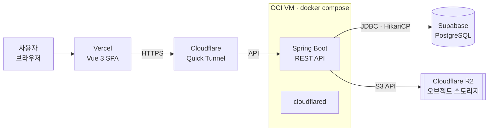
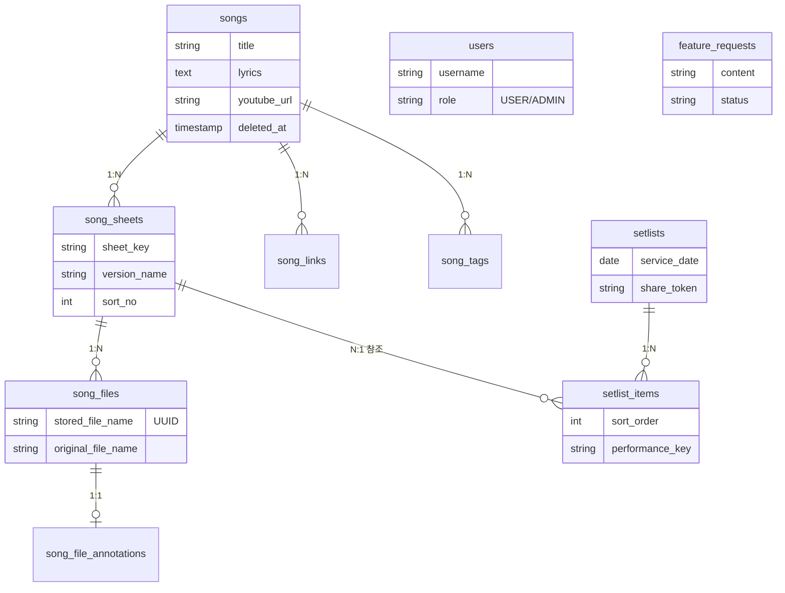
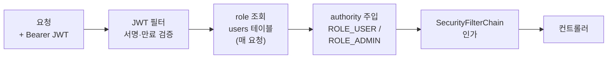

# Setflow — 아키텍처 정의서

> 예배·공연용 악보를 곡 단위로 관리하고 셋리스트(콘티)를 구성하는 웹 애플리케이션.
> SPA 프론트엔드 · REST 백엔드 · 관리형 Postgres · 오브젝트 스토리지를 조합한 소규모 운영 구성.

| 항목 | 값 |
|------|-----|
| 문서 버전 | v1.0 |
| 기준 | `main` · 2026.08 |
| 상태 | Production |
| 스키마 | Flyway V1–V18 |

시각화된 버전(다이어그램 포함)은 별도 아티팩트로도 제공됩니다. 이 문서는 저장소 유지보수용 정식본입니다.

---

## §01 개요

단일 팀·소규모 사용을 전제로, **관리형 서비스**(프론트 호스팅·DB)와 **컨테이너 기반 자체 호스팅**(백엔드)을 섞은 구성이다. 프론트엔드는 정적 SPA로 배포되고, 모든 상태·파일 조작은 백엔드 REST API를 통한다. 곡·악보·파일·셋리스트가 핵심 도메인이며, 모든 삭제는 복구 가능한 **soft delete**로 처리한다.

- **프론트엔드** — Vue 3 SPA, Vercel 정적 호스팅(Git 연동 자동배포)
- **백엔드** — Spring Boot REST API, OCI VM에서 Docker Compose로 상시 구동
- **데이터** — Supabase(PostgreSQL), 파일은 Cloudflare R2 오브젝트 스토리지
- **노출** — Cloudflare Tunnel로 백엔드를 HTTPS로 공개

---

## §02 시스템 구성

브라우저의 모든 API 요청은 Vercel이 서빙한 SPA에서 출발해 Cloudflare Tunnel을 거쳐 OCI VM의 백엔드에 도달한다. 백엔드만이 Supabase·R2에 접근한다.

프론트엔드는 `VITE_API_BASE_URL`로 터널 주소를 가리킨다. 요청은 SPA → Tunnel → 백엔드로 단방향 흐른다.

---

## §03 기술 스택

| 계층 | 기술 | 역할 · 비고 |
|------|------|-------------|
| 프론트엔드 | Vue 3 · TypeScript · Vite | SPA. Pinia 상태관리, Vue Router 가드 |
| UI | Tailwind v4 · shadcn-vue 스타일 | 다크 기본 테마, CSS 변수 토큰, 반응형 |
| 백엔드 | Java 17 · Spring Boot · Gradle | REST API, Spring Security |
| DB | PostgreSQL (Supabase) | Flyway 마이그레이션, HikariCP 풀 |
| 스토리지 | Cloudflare R2 | S3 호환. `STORAGE_TYPE`으로 local↔r2 전환 |
| 호스팅 | Vercel · OCI VM | 프론트 정적 / 백엔드 Docker Compose |
| 노출 | Cloudflare Quick Tunnel | 도메인 없이 HTTPS. 주소는 재시작마다 변동 |
| CI/CD | GitHub Actions | 빌드·테스트 / SSH 배포 / 생존 확인 |

---

## §04 백엔드 아키텍처

도메인별 패키지로 나뉜 레이어드 구조다. 각 도메인은 `Controller → Service → Repository(JPA)` 흐름을 따르고, 공통 관심사(예외·검증·DTO)는 `global`에, 보안·스토리지 설정은 `config`에 모은다.

| 패키지 | 책임 | 주요 컨트롤러 |
|--------|------|----------------|
| `song` | 곡·악보 버전·파일·링크·태그 | Song · SongSheet · SongFile · SongLink |
| `setlist` | 콘티와 곡 순서·연주키 | Setlist · SetlistItem |
| `auth` | JWT 발급·검증, 게스트 로그인 | Auth |
| `admin` | 사용자·콘텐츠 휴지통·기능요청 관리 | AdminUser · AdminContent · AdminFeatureRequest |
| `storage` | 파일 저장 추상화(전략 패턴) | StorageMigration |
| `featurerequest` | 사용자 기능 요청 접수 | FeatureRequest |
| `global` · `config` | 전역 예외·검증·DTO / 보안·스토리지 설정 | GlobalExceptionHandler |

### 스토리지 추상화 (전략 패턴)

`StorageService` 인터페이스 뒤에 `LocalStorageService`와 `R2StorageService` 두 구현을 두고, `STORAGE_TYPE` 설정값으로 주입 대상을 고른다. 애플리케이션 코드는 저장 위치를 모른 채 동일한 API로 파일을 다루므로, 로컬 디스크와 R2 사이를 설정만으로 전환할 수 있다.

---

## §05 도메인 · 데이터 모델

곡(`songs`)을 정점으로 악보 버전과 파일이 계층을 이루고, 콘티(`setlists`)의 각 항목이 특정 **악보 버전**을 참조한다. 인증용 `users`는 콘텐츠와 분리된 공유 라이브러리 구조다.

**핵심:** 콘티 항목(`setlist_items`)이 곡이 아니라 **악보 버전(`song_sheets`)**을 참조한다 — 같은 곡의 여러 키/버전 중 어느 것을 쓸지 콘티마다 지정한다. 모든 테이블은 `deleted_at`(soft delete)을 가진다.

---

## §06 프론트엔드 아키텍처

13개 화면(`views/`)을 Vue Router로 묶고, **Pinia 스토어**(`authStore` · `songStore` · `setlistStore`)가 상태를 관리한다. 모든 HTTP는 단일 axios 인스턴스(`apis/http.ts`)를 거치며, 여기서 토큰 첨부·401 자동 로그아웃·전역 로딩바를 처리한다.

- **백엔드 장애 폴백** — `apiBase.ts`가 1차 주소(터널)가 응답 없을 때만 2차로 자동 전환. 4xx/5xx는 폴백 대상이 아님.
- **라우터 가드** — 미인증 시 `/login` 리다이렉트. 단 `/share/*` 등 공개 경로는 예외.
- **테마** — 다크 기본, CSS 변수 토큰 시스템, `index.html` 인라인 스크립트로 FOUC 방지.
- **악보 뷰어** — 이미지 슬라이드 캐러셀, 키보드/스와이프 내비게이션, 스타일러스 필기(벡터 저장), PDF 내보내기(jsPDF).

---

## §07 인증 · 인가

자체 구현 JWT(30일 만료) 기반 무상태 인증이다. 눈여겨볼 점은 **매 요청마다 DB에서 역할을 다시 조회**한다는 것 — 관리자 지정·해제가 재로그인 없이 즉시 반영된다.

- 공개 경로 — `/api/auth/**`, `GET /api/setlists/share/**`, `GET /api/song-files/*/view`·`/download`
- 게스트(`"guest"`)는 DB 사용자 없이 `ROLE_USER`만 부여
- `/api/admin/**` → `hasRole('ADMIN')`

---

## §08 배포 · 운영

`main` 브랜치 push가 배포의 트리거다. 프론트는 Vercel이 Git 연동으로 자동 배포하고, 백엔드는 GitHub Actions가 SSH로 OCI VM에 접속해 재배포한다.

| 워크플로우 | 트리거 | 동작 |
|-----------|--------|------|
| `backend-ci` | PR · push | 백엔드 컴파일·테스트 검증 |
| `oci-deploy` | main push | SSH → `git reset --hard` → `docker compose up -d --build` |
| `oci-keep-alive` | 매일 1회 | 게스트 로그인 요청으로 Supabase 일시정지·터널 idle 끊김 예방 |

> **⚠ 운영 주의 — Quick Tunnel**
> 도메인이 없어 Cloudflare Quick Tunnel을 쓰므로 백엔드 주소(`*.trycloudflare.com`)가 **컨테이너 재시작(재배포·재부팅)마다 바뀐다.** 배포 후 Vercel의 `VITE_API_BASE_URL`을 새 주소로 수동 갱신해야 하며(워크플로우 로그 마지막 줄에 출력), 프론트의 폴백 로직이 그 사이 공백을 일부 완충한다. 고정 도메인 + Named Tunnel로 전환하면 근본 해소된다.

---

## §09 핵심 설계 결정

| # | 결정 | 근거 |
|---|------|------|
| D1 | **전면 Soft Delete** | 모든 삭제는 `deleted_at` 기록. 관리자 휴지통에서 곡·콘티를 복구할 수 있고, 실수 삭제가 비가역 사고로 이어지지 않는다. |
| D2 | **스토리지 전략 패턴** | 파일 접근을 인터페이스 뒤로 숨겨 로컬↔R2를 설정만으로 전환. 애플리케이션 코드는 저장 위치를 모른다. |
| D3 | **요청당 역할 조회** | JWT에 role을 굽지 않고 매 요청 DB에서 조회 → 권한 지정·해제가 재로그인 없이 즉시 반영. |
| D4 | **HikariCP 재개 튜닝** | 관리형 DB가 유휴 커넥션을 끊는 환경 대비, keepalive·max-lifetime을 짧게 + PGJDBC 소켓 타임아웃으로 죽은 커넥션을 빨리 교체. |
| D5 | **프론트 백엔드 폴백** | 1차 백엔드 무응답 시에만 2차로 자동 재시도. 터널 주소 변동·순단을 완충. |
| D6 | **업로드 흰배경 평탄화** | 투명 PNG가 다크 뷰어에서 검게 보이는 문제를 업로드 시 흰 배경으로 굽어 원천 차단. 악보엔 WebP/무손실 PNG를 쓰고 JPEG는 지양. |
